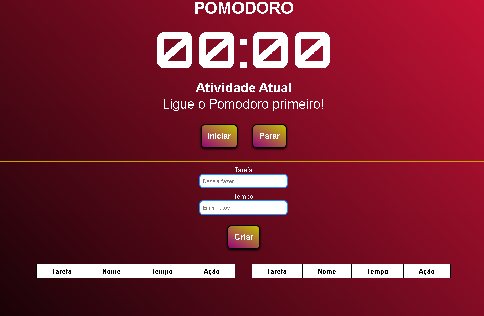

# Pomodoro Web
Sistema de controle de tempo, ideal para ter maior foco em suas tarefas diárias.
## Tecnologias Utilizadas

## Demonstração do projeto

https://lucasbonny.github.io/Pomodoro/

Layout do Pomodoro Web

## Tempo de produção
- 16 horas.

## Dificuldades
- Timer reverso.

## Aprendizado
- Usar versionamento de código na prática.
- Melhoria em instanciar um SetInterval
- Saber que tem o clearInterval
- Usar o básico do **readme**
## O que falta?
### Ordem de prioridade
- Pular Atividade
- Pausar pomodoro
- Limpar Tudo no pomodoro
- input de intervalo

## Ultimo Update
- Corrigir a ultima tarefa que faz quebrar - Corrigido
- Colocar um som quando acabar uma tarefa - Adicionado
- Bloquear a tarefa #1 para não ser movida quando estiver rodando. - Melhorado e corrigido
- Tratamento apartir de 60 minutos - Feito
- Converter minutos para horas - Feito

## Como executar

1. Baixe o projeto em seu computador.
2. Extraia o ZIP.
3. Abra o arquivo: **index.html**.

## Licença
